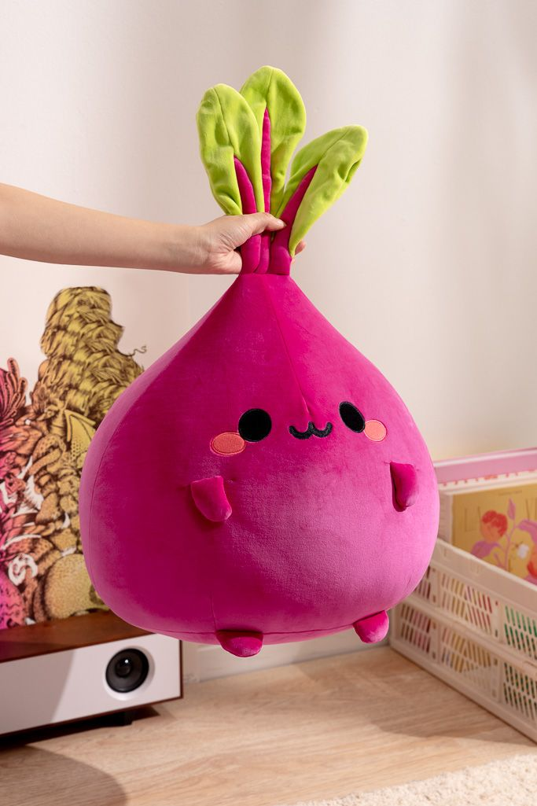

🌈🌈🌈🎮🌈
# Kevin's Adventure Game



This is a test repo for a text-based adventure game featuring Kevin, our adorable pink and green beet mascot!

Last updated: April 22, 2025
OS: Linux modal 4.4.0 x86_64 GNU/Linux

## Installation

1. Clone the repository:
   ```
   git clone https://github.com/kevin-s-github/kevins-adventure-game.git
   ```

2. Run the game:
   ```
   python main.py
   ```

## Usage

1. Follow the prompts in the game.
2. Type 'help' at any time to see available commands.
